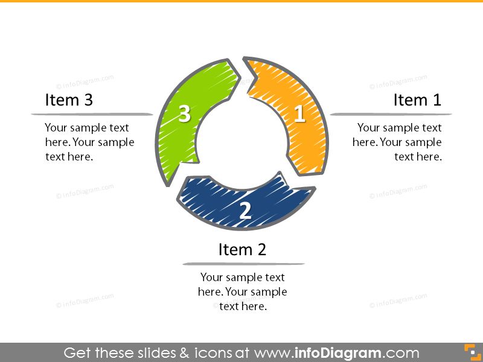

# Best Practices Handbook for Software Quality Assurance

Purpose of the document and outline documents structure, for example introduction -> into content folder -> Task Estimation, Code review, and maintainable code. All diagrams will also be in a sub folder in content folder. 

## Task Estimation in Scrum

- bullet points

### References
1. name/website, (date) "Title". Available at : link

## Code Review

- bullet points

### References
1. name/website, (date) "Title". Available at : link

## Maintainable Code

- bullet points

### References
1. name/website, (date) "Title". Available at : link
